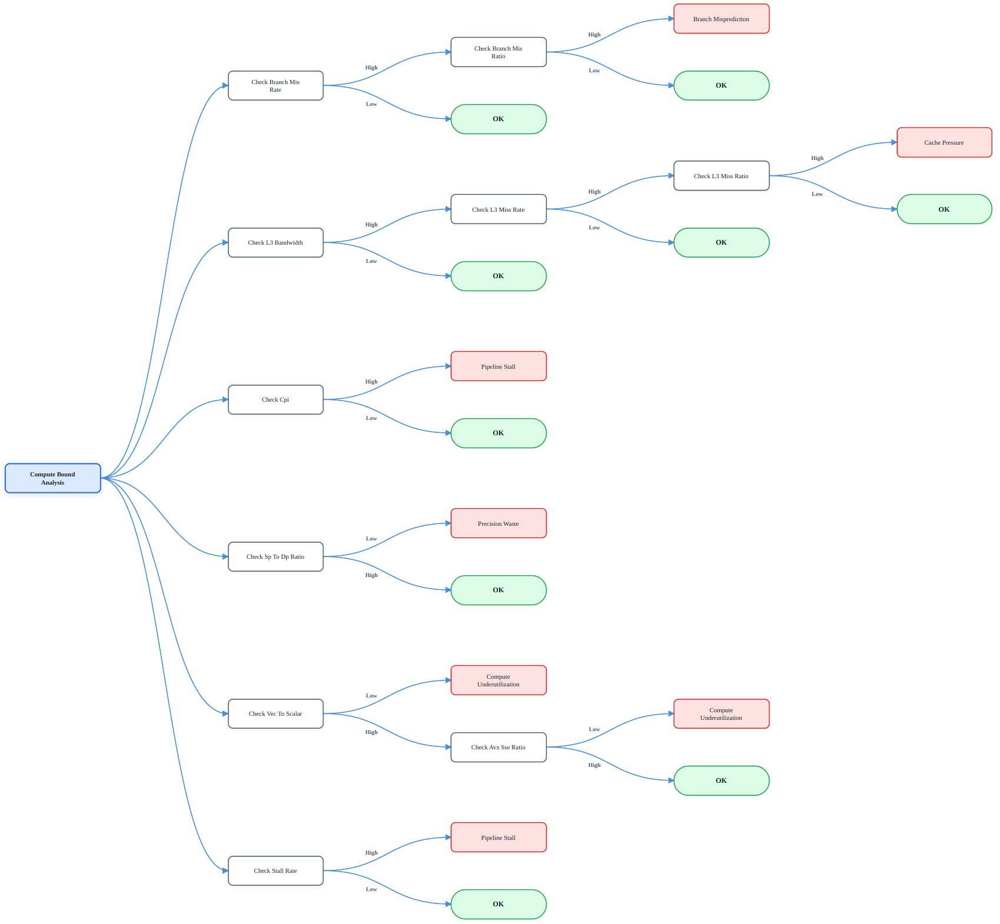
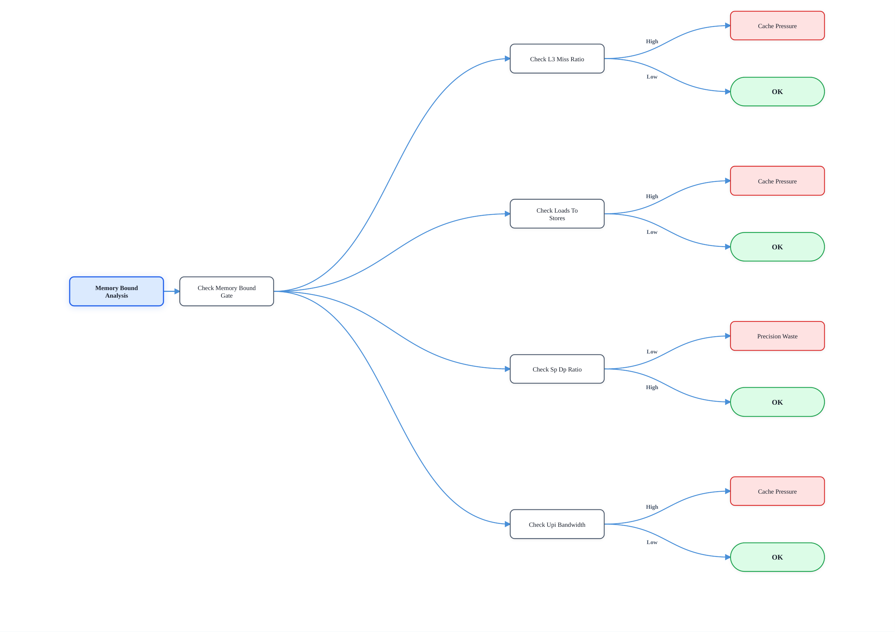
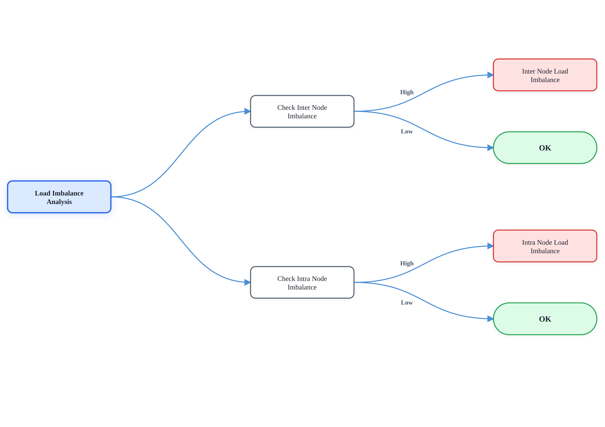

<div align="center">
  
</div>

# HPC Bottleneck Detector

Automated performance analysis and bottleneck detection for HPC applications.

This tool identifies performance bottlenecks in HPC jobs using system-wide time-series metrics collected by [XBAT](https://github.com/MEGWARE-HPC/xbat). It requires no source code instrumentation and supports two detection strategies: a rule-based heuristic approach and a weakly-supervised ML approach. Results are per-window diagnoses with severity scores, confidence scores, and actionable recommendations.

---

## Features

- **Two detection strategies**: rule-based YAML decision trees (heuristic) and weakly-supervised ML
- **No source code instrumentation** required: works from system-level metrics alone
- **Sliding-window analysis**: processes time series in overlapping windows, producing per-window diagnoses
- **Interpretable output**: each diagnosis includes severity, confidence, triggered metrics, and a recommendation

---

## Bottleneck Types

| Bottleneck Type             | Category       | Description                                              |
| --------------------------- | -------------- | -------------------------------------------------------- |
| `PIPELINE_STALL`            | Compute-bound  | High CPI due to instruction pipeline stalls              |
| `COMPUTE_UNDERUTILIZATION`  | Compute-bound  | Low utilization of available FP compute throughput       |
| `PRECISION_WASTE`           | Compute-bound  | Using double precision where single precision suffices   |
| `BRANCH_MISPREDICTION`      | Compute-bound  | Frequent branch mispredictions stalling the pipeline     |
| `CACHE_PRESSURE`            | Memory-bound   | High cache miss rate causing memory-bandwidth bottleneck |
| `INTRA_NODE_LOAD_IMBALANCE` | Load imbalance | Uneven load distribution across cores within a node      |
| `INTER_NODE_LOAD_IMBALANCE` | Load imbalance | Uneven load distribution across nodes in the job         |

---

## Installation

```bash
git clone https://github.com/Crippius/hpc-bottleneck-detector.git
cd hpc-bottleneck-detector
pip install -r requirements.txt
```

Copy the credentials template and fill in your XBAT details:

```bash
cp .env.example .env
# edit .env: set XBAT_API_BASE, USERNAME, PASSWORD, CLIENT_ID
```

---

## Quick Start

```bash
python examples/demo.py --job-id <JOB_ID>
```

This runs the full pipeline: fetches job data from XBAT, slides a 10-interval analysis window over the time series, and prints a severity heatmap with per-window diagnosis summaries.

---

## Configuration

The main config is `configs/demo.yaml`. Key options:

| Key                           | Default     | Description                                               |
| ----------------------------- | ----------- | --------------------------------------------------------- |
| `pipeline.window_size`        | `10`        | Number of intervals per analysis window                   |
| `pipeline.step_size`          | `10`        | Intervals to advance between windows                      |
| `strategy.type`               | `heuristic` | `heuristic` or `supervised_ml`                            |
| `output.min_severity`         | `0.3`       | Suppress diagnoses below this severity (heuristic output) |
| `output.min_confidence`       | `0.3`       | Suppress diagnoses below this confidence (ML output)      |
| `output.show_healthy_windows` | `false`     | Whether to print windows with no bottlenecks              |

To switch to the ML strategy, comment out the heuristic block and uncomment `supervised_ml` in the config, pointing `model_path` at a trained model:

```yaml
strategy:
  type: supervised_ml
  model_path: models/default.pkl
  significance_threshold: 0.3
```

---

## Detection Strategies

### Heuristic (rule-based)

YAML decision trees in `configs/strategies/persyst_strategy/`. Each file encodes one bottleneck type as a nested compare-then-branch tree. Inner nodes aggregate a metric (mean, max, ...) and compare it against a threshold. Thresholds can be absolute or hardware-relative (e.g. a fraction of peak FLOPS from the CPU hardware profile).

### Supervised ML (weak supervision)

The ML pipeline uses the heuristic strategy itself to generate weak training labels (`scripts/training/label_jobs.py`). Features are extracted from raw time series using [tsfresh](https://tsfresh.readthedocs.io), filtered with FDR-based selection, and fed into a Random Forest classifier, one per bottleneck type. This lets the model generalize the heuristic rules to jobs it has never seen.

---

## Strategy Trees

The full decision logic for each bottleneck category:

**Compute-bound**


**Memory-bound**


**Load imbalance**


For an interactive view, open [`persyst_strategy_trees.html`](persyst_strategy_trees.html) in a browser.

---

## Training Your Own Model

```bash
# 1. Generate weak labels using the heuristic strategy
python scripts/training/label_jobs.py --job-ids 100 101 102 --output data/labels/

# 2. Train the ML model
python scripts/training/train_ml_model.py --data-dir data/labels/ -o models/my_model.pkl
```

---

## Project Structure

```
src/hpc_bottleneck_detector/
├── orchestrator.py      # AnalysisOrchestrator: top-level pipeline coordinator
├── data_sources/        # XBAT REST API and CSV data source implementations
├── data/                # DataManager, metric access, hardware profiles
├── strategies/          # IAnalysisStrategy, HeuristicStrategy, SupervisedMLStrategy
├── ml/                  # ML backends: tsfresh feature extraction, classifiers
├── output/              # Diagnosis and WindowDiagnosis domain models
└── utils/               # Shared utilities
```

---

## License

See [LICENSE](LICENSE) for details.
