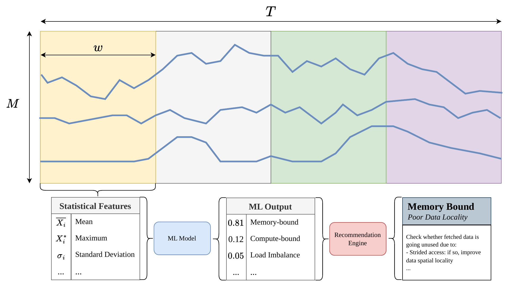

<div align="center">
  
</div>

# HPC Bottleneck Detector

Automated performance-bottleneck diagnosis for HPC applications, from
system-wide monitoring data alone.

[](LICENSE)
[](https://doi.org/10.5281/zenodo.21679739)

---

## About

HPC applications routinely reach only a fraction of a system's theoretical peak
performance, and the domain scientists who write them rarely have the
architectural expertise to turn raw hardware performance counters into concrete
optimizations. Rule-based recommendation systems such as PerSyst close that
actionability gap by mapping diagnoses to advice, but depend on static,
architecture-specific thresholds that need manual maintenance. Machine-learning
anomaly detectors are more adaptive, but stop at labeling an anomaly without
saying what to do about it.

This project implements and compares two designs that each navigate that
trade-off differently:

- a **heuristic engine**: twelve PerSyst-derived strategy trees expressed as
  portable YAML decision trees; and
- a **weakly-supervised ML pipeline**: one classifier (XGBoost by default,
  Random Forest also shipped) per bottleneck type, trained on labels the
  heuristic engine generates itself, with no human annotation.

Both work from time-series metrics collected by
[xbat](https://github.com/MEGWARE-HPC/xbat), require no source-code
instrumentation, and produce per-window diagnoses carrying a severity score, a
confidence score, the metrics that triggered them, and an actionable
recommendation. They are validated against ground-truth faults from the HPC
Performance Anomaly Suite (HPAS).

In practice the heuristic engine is the primary tool; the ML pipeline adds
cross-architecture robustness and surfaces candidate new rules.

This is the companion code to the MSc thesis _A Weakly-Supervised Machine
Learning Framework for Actionable Bottleneck Diagnosis in HPC Applications_
(University of Luxembourg / Politecnico di Milano, 2026). Link to be added once
published.

---

## What it detects

| Bottleneck Type             | Category       | Description                                                |
| --------------------------- | -------------- | ---------------------------------------------------------- |
| `PIPELINE_STALL`            | Compute-bound  | High CPI due to instruction pipeline stalls                |
| `COMPUTE_UNDERUTILIZATION`  | Compute-bound  | Low utilization of available FP compute throughput         |
| `PRECISION_WASTE`           | Compute-bound  | Using double precision where single precision suffices     |
| `BRANCH_MISPREDICTION`      | Compute-bound  | Frequent branch mispredictions stalling the pipeline       |
| `CACHE_PRESSURE`            | Memory-bound   | High cache miss rate causing a memory-bandwidth bottleneck |
| `INTRA_NODE_LOAD_IMBALANCE` | Load imbalance | Uneven load distribution across cores within a node        |
| `INTER_NODE_LOAD_IMBALANCE` | Load imbalance | Uneven load distribution across nodes in the job           |

The heuristic engine covers all seven classes. The ML pipeline covers the six
single-node classes, it excludes `INTER_NODE_LOAD_IMBALANCE`, for which the
training corpus (all single-node runs) has no examples.

---

## How it works



A job's multivariate hardware-counter time series is fetched from xbat (or read
from a CSV export), and a 12-interval window (~60 s at 5 s sampling) is slid over
it. For each window the selected strategy produces zero or more diagnoses;
diagnoses below `min_severity` / `min_confidence` are dropped, and results are
emitted per window as JSON, CSV, or a terminal severity heatmap.

Architecture-level detail (class diagrams) is in [`docs/class-diagrams/`](docs/class-diagrams/).

---

## Installation

```bash
git clone https://github.com/Crippius/hpc-bottleneck-detector.git
cd hpc-bottleneck-detector
uv sync
```

This installs the package into a local `.venv` along with the `bottleneck-detect`
CLI command. To also install the dependencies used by the notebook and the
analysis / training scripts, run `uv sync --extra dev` instead.

Copy the credentials template and fill in your xbat details:

```bash
cp .env.example .env
# edit .env: set XBAT_API_BASE, XBAT_USERNAME, XBAT_PASSWORD, XBAT_CLIENT_ID
# (optional: XBAT_PROXY, XBAT_VERIFY_SSL)
```

---

## Quick start

```bash
uv run bottleneck-detect --job-id <JOB_ID>
```

Run this from the repository root (config paths are resolved relative to the
current working directory). It fetches the job from xbat, slides a 12-interval
analysis window over the time series, runs the heuristic strategy, and prints the
diagnoses as JSON to stdout. Use `--format print` for a human-readable severity
heatmap, or `--output PATH` to write results to a file. See
`bottleneck-detect --help` for all options.

---

## Configuration

The main config is `configs/xbat_cli.yaml`. Key options:

| Key                           | Default     | Description                                                                     |
| ----------------------------- | ----------- | ------------------------------------------------------------------------------- |
| `pipeline.window_size`        | `12`        | Number of intervals per analysis window                                         |
| `pipeline.step_size`          | `12`        | Intervals to advance between windows (equal to `window_size` → non-overlapping) |
| `strategy.type`               | `heuristic` | `heuristic` or `supervised_ml`                                                  |
| `output.min_severity`         | `0.3`       | Suppress diagnoses below this severity (heuristic output)                       |
| `output.min_confidence`       | `0.3`       | Suppress diagnoses below this confidence (ML output)                            |
| `output.show_healthy_windows` | `false`     | Whether to print windows with no bottlenecks                                    |

To switch to the ML strategy, uncomment the relevant block in the config:

```yaml
# XGBoost
strategy:
  type: supervised_ml
  model_path: models/xgboost.pkl
  significance_threshold: 0.3
# Random Forest
strategy:
  type: supervised_ml
  model_path: models/rf.pkl
  significance_threshold: 0.3
```

or override it from the command line without touching the file:

```bash
uv run bottleneck-detect --job-id <JOB_ID> --model-path models/xgboost.pkl
```

(`--model-path` implies `--strategy supervised_ml`; pass `--strategy heuristic`
to go back.)

To run against an offline / archived CSV export instead of a live xbat
connection, set `data_source.type: csv` with a `file_path` pointing at a raw xbat
CSV export in long layout — one row per trace, columns
`jobId, group, metric, trace, interval 0, interval 1, …, interval N` — as
returned by the xbat `/api/v1/measurements/<job>/csv` endpoint.

---

## Strategy trees

The full decision logic for each bottleneck category:

**Compute-bound**


**Memory-bound**


**Load imbalance**


For an interactive view, open [`docs/persyst_strategy_trees.html`](docs/persyst_strategy_trees.html)
in a browser.

---

## Results

- **HPAS ground-truth faults** (independent labels): heuristic **6/6**, XGBoost
  **6/6**, Random Forest **5/6**.
- **Leave-one-out cross-validation**, macro F1: XGBoost **0.954**, Random Forest
  **0.926** — the ML pipeline closely reproduces the heuristic's labels.
- **Unseen AMD EPYC node, no retraining**: both classifiers still detect 5–6 of
  6 faults, while 3 of the 12 heuristic trees fail outright due to missing
  Intel-specific counters.

Full evaluation: Chapter 5 of the thesis.

---

## Dataset

The labelled dataset used to train and evaluate this project — the
20-application training corpus, the HSUper held-out generalization set, and the
HPAS fault-injection ground truth — is published separately on Zenodo:

**[HPC Bottleneck Detection Dataset: Labelled Performance Counter Traces](https://zenodo.org/records/21679739)**
— DOI: [10.5281/zenodo.21679739](https://doi.org/10.5281/zenodo.21679739)

`data/example.csv` is a small committed sample of a **labelled training CSV**.
This is the format `scripts/training/label_jobs.py` emits and
`scripts/training/train_ml_model.py` consumes.

---

## Project structure

```
src/hpc_bottleneck_detector/
├── cli.py               # bottleneck-detect CLI entry point
├── orchestrator.py      # AnalysisOrchestrator: top-level pipeline coordinator
├── data_sources/        # xbat REST API and CSV data source implementations
├── data/                # DataManager, metric access, hardware profiles
├── strategies/          # IAnalysisStrategy, HeuristicStrategy, SupervisedMLStrategy
├── ml/                  # tsfresh feature extraction, classifier backends
├── output/              # Diagnosis and WindowDiagnosis domain models
└── utils/               # weak-supervision labeling, shared utilities

configs/
├── xbat_cli.yaml        # main CLI config
├── strategies/          # the 12 heuristic strategy trees (YAML)
├── hardware_profiles/   # per-CPU peak values for hardware-relative thresholds
├── classifiers/         # RF / XGBoost hyperparameters and search grids
└── ml_recommendations.yaml  # class-level recommendation text for the ML strategy

scripts/                 # experiment and analysis scripts used for the thesis
├── training/            # label_jobs, train_ml_model, tune_hyperparams
├── evaluation/          # LOO CV, HPAS ground truth, held-out, scaling
├── analysis/            # feature importance, SHAP, heuristic-vs-ML disagreement
└── plots/               # thesis figures

models/                  # trained models: rf.pkl, xgboost.pkl
data/                    # example.csv + Zenodo corpora
results/                 # committed experiment outputs
notebooks/               # feature_importance_analysis.ipynb
docs/                    # class-diagrams/, persyst_strategy_trees.html
media/                   # logo, pipeline figure, strategy-tree renders
```

---

## License

Code is licensed under MIT - see [LICENSE](LICENSE) for details.

The dataset is licensed separately under CC BY 4.0 - see the
[Zenodo record](https://zenodo.org/records/21679739).
